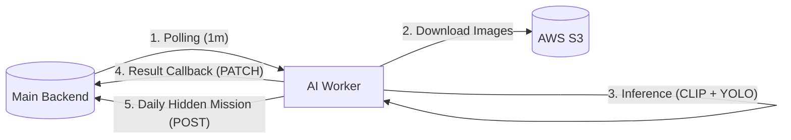

# 🤖 온-동네 (On-Dongnae) - AI Service Worker

**온-동네 AI Service**는 플랫폼의 지능형 엔진으로, 사용자의 활동을 실시간으로 검증하고 환경 맞춤형 히든 미션을 생성하는 **자율 동작형 워커(Worker)**입니다. 단순한 API 서버를 넘어, 딥러닝 모델(VLM, Object Detection)과 스케줄러가 결합되어 백엔드와 유기적으로 통신하며 서비스의 신뢰성을 담보합니다.

> [!IMPORTANT]
> 본 서비스는 백엔드의 호출을 대기하지 않고, 주기적으로 배포된 백엔드를 폴링(Polling)하여 작업을 수행하는 **Worker-Mode 아키텍처**로 설계되었습니다.

## 🧠 지능형 엔진 핵심 기능 (Intelligent Features)

### 1. 멀티모달 기반 미션 검증 (Vision-Language Verification)
- **CLIP (Contrastive Language-Image Pre-training)**: 사용자가 제출한 사진과 미션 설명(Text) 간의 시맨틱 유사도를 분석하여 활동의 맥락을 파악합니다.
- **YOLOv8 객체 탐지**: 쓰레기 봉투, 텀블러, 재활용품 등 미션 수행에 필수적인 객체의 존재 여부와 개수를 실시간으로 탐지합니다.
- **앙상블 판정 로직**: CLIP 점수, YOLO 탐지 결과, 이미지 품질 점수를 피처로 사용하여 Scikit-learn 기반의 Logistic Regression 모델이 최종 승인(APPROVED) 여부를 결정합니다.

### 2. 기상 데이터 기반 히든 미션 추천
- **실시간 날씨 분석**: OpenWeather API를 통해 서울시의 강수 확률, 기온, 대기질 데이터를 수집합니다.
- **컨텍스트 맞춤형 생성**: 수집된 기상 데이터와 현재 계절을 결합하여 '우천 시 실내 미션', '맑은 날 플로깅 미션' 등 유동적인 히든 미션을 AI가 직접 설계합니다.
- **자동 발행 파이프라인**: 매일 자정(00:00), AI가 생성한 최적의 미션을 메인 백엔드 서버의 관리자 API로 자동 등록합니다.

### 3. 자율 스케줄링 및 S3 연동
- **APScheduler 기반 워커**: 1분 단위로 인증 대기 목록을 폴링하여 대량의 요청을 비동기적으로 처리합니다.
- **AWS S3 Direct Access**: 클라우드 저장소의 이미지를 직접 스트리밍하여 분석함으로써 서버 메모리 효율을 최적화합니다.

## 🛠 기술 스택 (Tech Stack)

| 구분 | 기술 |
| :--- | :--- |
| **Language** | Python 3.10+ |
| **Deep Learning** | PyTorch, Transformers (CLIP), Ultralytics (YOLOv8) |
| **Machine Learning** | Scikit-learn, Pandas, Joblib |
| **Framework** | FastAPI (Health Check & Test API) |
| **Task Scheduler** | APScheduler |
| **Cloud & Infra** | AWS S3 (Boto3), Docker, EC2 (t3.medium) |

## 🏗 시스템 아키텍처 (Architecture)



## 📂 프로젝트 구조 (Structure)

```bash
ai_service/
├── app/
│   ├── main.py             # FastAPI 엔드포인트 및 Lifespan 관리
│   ├── scheduler.py        # 백그라운드 폴링 및 미션 발행 로직 (핵심)
│   ├── weather_client.py   # 외부 기상 API 연동 및 데이터 전처리
│   ├── s3_uploader.py      # AWS S3 이미지 처리 유틸리티
│   └── hidden_mission_recommender.py  # AI 기반 미션 추천 알고리즘
├── models/                 # 학습된 ML 모델 (.joblib) 및 가중치
├── data/                   # 미션 생성 및 분석용 기준 데이터셋
├── Dockerfile              # 컨테이너화 설정 (Production)
└── requirements.txt        # 의존성 패키지 목록
```

## 🚀 시작하기 (Getting Started)

### 환경 변수 설정 (.env)
```text
BACKEND_URL=https://api.on-dongnae.site
OPENWEATHER_API_KEY=your_api_key
AWS_ACCESS_KEY=your_access_key
AWS_SECRET_KEY=your_secret_key
AWS_REGION=ap-northeast-2
S3_BUCKET_NAME=odn-bucket
```

### 로컬 실행
```bash
cd ai_service
pip install -r requirements.txt
uvicorn app.main:app --reload --port 8000
```

## 🚀 배포 가이드 (Deployment)

### 인프라 요구 사항
- **Instance**: AWS EC2 `t3a.medium` (RAM 4GB 권장)
- **Security Group**: Outbound 80/443 허용 (Inbound 8000은 선택사항)

### Docker 실행
```bash
# 이미지 빌드
docker build -t odn-ai-worker .

# 컨테이너 실행 (환경변수 파일 포함)
docker run -d --name ai-worker --env-file .env --restart unless-stopped odn-ai-worker
```

## 🎨 기술적 전략 (Technical Strategy)
- **Model Quantization**: CPU 환경에서의 추론 속도 향상을 위해 FP16 또는 최적화된 가중치 로드 방식을 사용합니다.
- **Error Resiliency**: 백엔드 서버 일시 중단 시에도 스케줄러가 지수 백오프(Exponential Backoff)를 고려하여 재시도하도록 설계되었습니다.
- **Memory Management**: 대형 모델 로드 시의 메모리 릭 방지를 위해 가비지 컬렉션 및 전역 캐싱(`@lru_cache`)을 전략적으로 활용합니다.
